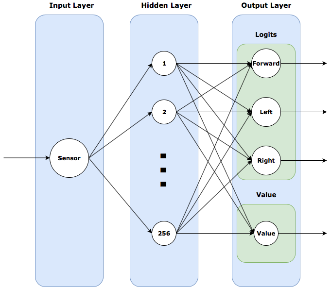

# Robô explorador com treinamento por reforço
>  Por Andre Tsuyoshi Sakiyama. 30 de Maio de 2018
<br/>

## Introdução

Neste artigo vamos treinar um robô para explorar o ambiente com diversos obstáculos. O nosso explorador possui um sensor de presença que permite a detecção de objetos a sua frente. Além disso, ele possui três ações disponíveis: andar para frente, rotacionar no sentido horário e rotacionar no sentido anti-horário. Será aplicado o método de treinamento por reforço com o intuito de deixar o robô decidir qual a melhor escolha a se tomar em cada situação e evitar entregar diretamente todas as respostas.

<br/>

## O que é treinamento por reforço

Qual é a primeira coisa que vem a cabeça quando pensamos em treinamento por reforço? Alguém treinando sem parar para uma competição? Um aluno que está quase reprovando e precisa de aulas de reforço? Aprender com alguém que só usa pleonasmo? Bom, a melhor maneira de visualizar é com um exemplo. Imagine a seguinte situação: você, ser humano, precisa ler um livro de 30 capítulos em 30 dias. Ao mesmo tempo você gosta muito de chocolate e odeia muito jiló. Para te ajudar a terminar o livro, a cada dia que você ler um capítulo do livro, você come um pedaço de chocolate, e para cada dia que não ler você come um pedaço de jiló. A medida que você vai tentando ler o livro, o seu cérebro vai percebendo que ler um capítulo no dia é bom e não ler é ruim, e indiretamente o seu objetivo se torna maximizar a sua recompensa recebida. Passaram-se 30 dias e, infelizmente, você não conseguiu terminar o seu livro. Não tem problema, você pode tentar novamente começando o livro do zero, mas dessa vez o seu cérebro já começou a perceber que ler te traz recompensa, então você vai conseguir ir um pouco mais longe, e da próxima vez um pouco mais longe e da próxima um pouco mais, até que, algum dia, você consegue atingir o seu objetivo de ler o livro em 30 dias.

Agora vamos pensar no nosso problema de treinar um robô para explorar o ambiente sem bater em nada. Cada ação gera uma consequência. Podemos pensar que andar para frente e não bater em nada é o nosso chocolate, e andar para frente e bater em algo é o nosso jiló. Mas o girar seria o que? Girar não é tão bom quanto andar, simplesmente pelo fato que ao girar o robô não sai do lugar, mas não é tão ruim quanto bater, então podemos supor que girar seria um chocolatinho, porque apesar do robô não andar, ele ganha informação do ambiente e desvia de possíveis obstáculos.

<br/>

## Ambiente de treinamento

*Arquivo ``training_map.py`` do repositório*

Para não complicar as nossas vidas, o ambiente de treinamento é uma matriz 100x100 apenas com 1 e 0, onde 1 representa paredes e 0 espaço vazio. O mapa é gerado aleatoriamente com uma proporção de 4 espaços para 1 parede, porém as bordas do mapa são sempre paredes. Nesse caso podemos imaginar que o robô tem um tamanho de uma unidade e que ao andar, ele percorre sempre uma unidade de cada vez.

```python
import random
import numpy as np
from scipy.sparse import rand

length = 100
width = 100
map_density = 0.2

def generate_map():
    new_map = rand(length, width, density=map_density)
    new_map.data[:] = 1
    new_map = np.array(new_map.A)
    new_map = new_map.astype(int)
    new_map[:][0] = 1
    new_map[:][width - 1] = 1
    new_map[:,0] = 1
    new_map[:,length - 1] = 1

    return new_map
```

O nosso robô é inicializado com posição e com direção aleatórias, onde a direção 1 é para cima, 2 para direita, 3 para baixo e 4 para esquerda

```python
def random_inital_pos(area_map):

    done = False
    x_pos = -1
    y_pos = -1

    while(not done):
        i = random.randint(1,len(area_map) - 2)
        j = random.randint(1,len(area_map[0]) - 2)
        if (area_map[i][j] == 0):
            x_pos = i
            y_pos = j
            done = True

    return x_pos, y_pos


def random_initial_dir():
    direction = random.randint(1,4)
    return direction
```

Para simular o nosso sensor, o robô sempre tem a informação do quadrado a sua frente, ou seja, o robô "enxerga" até a uma unidade de distância a sua frente.

```python
def get_state(area_map, x_pos, y_pos, direction):

    state = np.zeros([1,1])

    if (direction == 1):
        state[0][0] = area_map[x_pos - 1][y_pos]
    elif (direction == 2):
        state[0][0] = area_map[x_pos][y_pos + 1]
    elif (direction == 3):
        state[0][0] = area_map[x_pos + 1][y_pos]
    elif (direction == 4):
        state[0][0] = area_map[x_pos][y_pos - 1]

    return state
```

E para simular um "passo" é necessário saber a posição atual, a direção atual e qual das 3 ações ele vai tomar, então é retornado o novo estado do sensor, a recompensa pela ação, se o robô bateu ou não, a nova posição e a nova direção. As recompensas são definidas por +5 se o robô andou e não bateu, +1 se o robô girou para qualquer das direções, e -30 se o robô andou para frente e bateu. Os valores da recompensas são arbitrárias e dependem de quanto uma recompensa deve valer em relação a outra.

```python
def next_step(area_map, next_choice, x_pos, y_pos, direction):
    last_x_pos = x_pos
    last_y_pos = y_pos
    last_dir = direction
    last_state = get_state(area_map, x_pos, y_pos, last_dir)

    if (next_choice == 'forward'):
        if (direction == 1):
            x_pos -= 1
        elif (direction == 2):
            y_pos += 1
        elif (direction == 3):
            x_pos += 1
        elif (direction == 4):
            y_pos -= 1
    elif (next_choice == 'right'):
        direction += 1
        if (direction > 4):
            direction = 1
    elif (next_choice == 'left'):
        direction -= 1
        if (direction < 1):
            direction = 4

    state = np.zeros(1)

    if (area_map[x_pos][y_pos] == 1):
        done = True
        direction = last_dir
        x_pos = last_x_pos
        y_pos = last_y_pos
        state = last_state
        reward = -30
    else:
        done = False
        state = get_state(area_map, x_pos, y_pos, direction)
        if (next_choice == 'forward'):
            reward = 5
        else:
            reward = 1

    return state, reward, done, x_pos, y_pos, direction
```

<br/>

## Rede Neural para o treinamento

Utilizaremos a biblioteca Tensorflow para facilitar a criação de nossa rede neural. O Tensorflow é uma biblioteca de código aberto especializada em computação numérica e utiliza a representação orientada a grafos. Originalmente desenvolvido pelo time Google Brain, era aplicado para pesquisas em aprendizado de máquina e redes neurais profundas. A biblioteca possui uma flexibilidade para atuar em diferentes plataformas como CPUs, GPUs e TPUs e consegue ser aplicado desde de desktops até devices mobile. Hoje, inúmeras empresas utilizam o Tensorflow para aplicações como recomendação, predição, classificação, processamento de linguagem natural e reconhecimento de voz e imagem.

*Arquivo ``neural_network_training.py`` do repositório*

Inicialmente definimos uma série de variáveis de ambiente: número máximo de épocas, número de episódios em um época, número de ações disponíveis, recompensa média, época atual, tamanho do batch, número de sensores e as ações disponíveis

```python
import tensorflow as tf
import numpy as np
import random

import training_map

# Environment Parameters
n_epochs = 5000
n = 0
n_actions = 3
average = []
step = 1
batch_size = 5000
sensor_number = 1

# Define our three actions of moving forward, turning left & turning right
choice = ['forward', 'left', 'right']
```

Em seguida definimos alguns parâmetros que serão utilizados em nossa rede neural. Alpha é a nossa taxa de aprendizado (learning rate) e gama é o nosso desconto da recompensa (reward discount)

```python
# Hyper Parameters
alpha = 1e-4
gamma = 0.99
normalize_r = True
save_path='models/test.ckpt'
value_scale = 0.5
entropy_scale = 0.00
gradient_clip = 40
```

Sempre que o robô toma uma ação, ele recebe uma recompensa relacionada a ação tomada. Cada recompensa passa por uma função de desconto. Essa função de desconto nos ajuda a comparar o quão bom é uma recompensa grande no futuro em relação a uma recompensa pequena no presente. Por exemplo: imagine que um indivíduo está tentando resolver um labirinto e chega em um momento que deve decidir entre um caminho curto que leva a uma recompensa pequena ou um caminho longo que leva a uma recompensa grande. Ajustando o gama é possível controlar qual dos dois caminhos este indivíduo deve escolher.

```python
# Apply discount to episode rewards & normalize
def discount(r, gamma, normal):
    discount = np.zeros_like(r)
    G = 0.0
    for i in reversed(range(0, len(r))):
        G = G * gamma + r[i]
        discount[i] = G
    # Normalize 
    if normal:
        mean = np.mean(discount)
        std = np.std(discount)
        if (std == 0):
            std = 0.001
        discount = (discount - mean) / (std)
    return discount
```

O próximo passo é construir a rede neural em si. Em nossa rede, o input é o estado do sensor e o output é a confiança de cada ação ser a melhor escolha para o determinado estado. A rede é composta por uma camada de input com o número de neurônios igual ao número de sensores, uma camada densa composta por 256 neurônios e duas camadas de saída, uma composta por 3 neurônios (logits) e outra por 1 neurônio (value). As camadas logits e value possuem a mesma camada antecessora, e serão utilizadas, respectivamente, nas funções policy approximation e value approximation. Estas funções fazem aproximações numéricas para calcular o custo e atualizar o pesos da rede neural para melhorar a confiança na decisão das ações futuras. Além disso, a saída da camada logits também passa pela função softmax e retornando a confiança em cada ação, que é armazenada na variável aprob.

```python
# Layers
fc = 256
activ = tf.nn.elu

# Tensorflow Variables
X = tf.placeholder(tf.float32, (None, sensor_number), name='X')
Y = tf.placeholder(tf.int32, (None,), name='actions')
R = tf.placeholder(tf.float32, (None,), name='reward')
N = tf.placeholder(tf.float32, (None), name='episodes')
D_R = tf.placeholder(tf.float32, (None,), name='discounted_reward')

dense = tf.layers.dense(
        inputs = X, 
        units = fc, 
        activation = activ,
        name = 'fc')

logits = tf.layers.dense(
         inputs = dense, 
         units = n_actions, 
         name='logits')

value = tf.layers.dense(
        inputs=dense, 
        units = 1, 
        name='value')

calc_action = tf.multinomial(logits, 1)
aprob = tf.nn.softmax(logits)

tf.trainable_variables()
```



Agora que temos a nossa rede neural, precisamos criar um indivíduo. Para cada indivíduo será armazenado o estado do sensor em cada passo, as suas ações tomadas e as recompensas recebidas. As decisões de cada indivíduo são baseadas na abordagem de Boltzmann, onde cada ação possui a chance de ser escolhida de acordo com a confiança dada pela rede, ou seja, em cada passo, quanto maior a confiança em uma determinada ação, maior será a chance dela ser executada.

O momento que um indivíduo bate em alguma parede define o fim de um episódio, e nesse momento é criado um novo indivíduo com uma nova posição e uma nova direção. Uma geração é definida por um conjunto de indivíduos tal que no fim do último indivíduo a soma de ações feitas por eles é maior que o batch_size, estabelecida inicialmente em 5000. Ao final de uma geração, os dados armazenados são retornados e servirão para atualizar os pesos da rede neural.

```python
def rollout(batch_size):
    
    states, actions, rewards, rewards_feed, discounted_rewards = [], [], [], [], []
    episode_num = 1
    action_repeat = 1
    reward = 0

    area_map = training_map.generate_map()
    x_pos, y_pos = training_map.random_inital_pos(area_map)
    direction = training_map.random_initial_dir()
    state = training_map.get_state(area_map, x_pos, y_pos, direction)
    
    while True: 
        # Run State Through Policy & Calculate Action
        feed = {X: state}
        prob = sess.run(aprob, feed_dict=feed)
        action = np.random.choice([0,1,2], p=prob[0])
        
        # Perform Action
        for i in range(action_repeat):
            state2, reward2, done, x_pos, y_pos, direction = training_map.next_step(area_map, choice[action], x_pos, y_pos, direction)
            reward += reward2
            if done:
                break
        
        # Store Results
        states.append(state[0])
        rewards.append(reward)
        actions.append(action)
        
        # Update Current State
        reward = 0
        state = state2.reshape(1, sensor_number)
        
        if done:
            # Track Discounted Rewards
            rewards_feed.append(rewards)
            discounted_rewards.append(discount(rewards, gamma, normalize_r))
            
            if len(np.concatenate(rewards_feed)) > batch_size:
                break
                
            # Reset Environment
            x_pos, y_pos = training_map.random_inital_pos(area_map)
            direction = training_map.random_initial_dir()
            state = training_map.get_state(area_map, x_pos, y_pos, direction)
            rewards = []
            episode_num += 1
                         
    return np.stack(states), np.stack(actions), np.concatenate(rewards_feed), np.concatenate(discounted_rewards), episode_num
```

Já temos o nosso mapa de treinamento e o nosso indivíduo, então vamos definir como o nosso robô irá aprender. Em redes neurais, existe o conceito de custo que representa o quão bom o seu modelo está para um conjunto determinado de dados. Em nosso problema o custo representa o quão duvidoso o robô está em relação a decisão a ser tomada, portanto queremos que em cada geração os pesos da rede neural sejam atualizados a fim de melhorar a confiança nas escolhas das ações, minimizando o custo.

O custo do policy approximation é calculado a partir da função sparse_softmax_cross_entropy, essa função assume que as nossas ações disponíveis sejam um conjunto finito e contável e o seu resultado é multiplicado pela diferença entre a recompensa descontada e a saída da camada value, resultando no custo do gradiente de policy approximation. O custo de value approximation é calculado a partir da média do quadrado do seu erro. Então o custo total é a soma de todos os custos calculados. A medida que o custo total vai se aproximando de zero, a confiança sobre uma determinada ação vai se aproximando de 100%, lembrando a confiança sobre uma ação é um valor de 0 a 1 e a soma de todas as confianças é sempre 1.

```python
mean_reward = tf.divide(tf.reduce_sum(R), N)

# Define Losses
pg_loss = tf.reduce_mean((D_R - value) * tf.nn.sparse_softmax_cross_entropy_with_logits(logits=logits, labels=Y))
value_loss = value_scale * tf.reduce_mean(tf.square(D_R - value))
entropy_loss = -entropy_scale * tf.reduce_sum(aprob * tf.exp(aprob))
loss = pg_loss + value_loss - entropy_loss

# Create Optimizer
optimizer = tf.train.AdamOptimizer(alpha)
grads = tf.gradients(loss, tf.trainable_variables())
grads, _ = tf.clip_by_global_norm(grads, gradient_clip) # gradient clipping
grads_and_vars = list(zip(grads, tf.trainable_variables()))
train_op = optimizer.apply_gradients(grads_and_vars)

# Initialize Session
sess = tf.Session()
init = tf.global_variables_initializer()
sess.run(init)
```

Estamos prontos para começar a treinar o nosso robô. O fluxo de treinamento se inicia com um estado do sensor do robô, este estado é alimentado na rede neural que gera as probabilidades de cada ação ser a melhor escolha no estado dado. Então é executada a ação e gerada uma recompensa e um novo estado do sensor. O novo estado é utilizado para continuar o ciclo de treinamento. No final de uma geração é retornado todos os estados, todas as ações executadas e todas as recompensas colhidas, que são utilizadas para atualizar os peso das rede neural.

```python
saver = tf.train.Saver(tf.global_variables())
load_was_success = True 

try:
    save_dir = '/'.join(save_path.split('/')[:-1])
    ckpt = tf.train.get_checkpoint_state(save_dir)
    load_path = ckpt.model_checkpoint_path
    saver.restore(sess, load_path)
except:
    print("No saved model to load. Starting new session")
    load_was_success = False
else:
    print("Loaded Model: {}".format(load_path))
    saver = tf.train.Saver(tf.global_variables())
    step = int(load_path.split('-')[-1])+1

while step < n_epochs+1:
    # Gather Training Data
    print('Epoch', step)
    s, a, r, d_r, n = rollout(batch_size)
    mean_reward = np.sum(r)/n
    average.append(mean_reward)
    print('Training Episodes: {}  Average Reward: {:4.2f}  Total Average: {:4.2f}'.format(n, mean_reward, np.mean(average)))
          
    # Update Network
    sess.run(train_op, feed_dict={X:s, Y:a, D_R: d_r})
          
    # Save Model
    if step % 10 == 0:
          print("SAVED MODEL")
          saver.save(sess, save_path, global_step=step)
          
    step += 1
```

Executando o arquivo ``neural_network_training.py`` iniciaremos o treinamento da rede neural. A cada 10 gerações, o arquivo salva a rede atual em models e este modelo pode ser utlizado para continuar um treinamento que foi interrompido ou para ser utilizado em alguma aplicação. No meu caso, eu deixei a rede treinando em CPU durante mais ou menos 7 horas, até chegar a geração 2540.

<br/>

## Simulação

Antes passar para um cenário real iremos para um simulador, onde será mais fácil visualizar a rede neural atuando sobre o comportamento do robô. O software que utilizaremos é o [V-REP](http://www.coppeliarobotics.com). Com este software é possível simular o robô, os sensores e os obstáculos. Com o v-rep abra a cena ``obstacle_avoid_1_sensors.ttt`` localizado na pasta scene, dê um play na cena e em algum terminal execute o arquivo ``simulation_script.py``, este arquivo carrega o último modelo salvo e simula o comportamento do robô, lendo os sensores e tomando decisões, porém ele não atualiza os pesos da rede neural.

Na primeira imagem temos o robô rodando com a inteligência da geração 0. Podemos observar que os movimentos são totalmente aleatório. Já na segunda imagem, temos a simulação utilizando a rede neural na geração 2540.
<p>
    
    
</p>
<br/>

## Testando

Para a nossa situação real, utilizamos o Lego Mindstorms NXT, com um sensor ultrassônico em sua região frontal. O ambiente é uma sala com diversas mesas e cadeiras. Inicialmente é necessário se conectar ao Lego Mindstorms via bluetooth e logo em seguida executar o arquivo ``main.py``. Este arquivo lê o sensor do robô e detecta objetos a uma distância de 50 cm. Com esses dados ele alimenta rede neural, recebe a ação que deve ser tomada e manda comando para os motores de acorda com a decisão feita.

<br/>

## Conclusão

O experimento mostrou que a utilização do treinamento por reforço com redes neurais é plausível para aplicações reais. A rede neural treinada teve um desempenho bom quanto a sua adaptação em diferentes circunstâncias (treinamento, simulação e situação real), porém possui um tempo de desenvolvimento muito maior do que uma solução mais simples, principalmente pelo fato que uma rede neural pode demorar um tempo consideravelmente alto para treinar. Assim sendo o nosso resultado obtido foi simples, porém eficaz, e mostrou que possui potencial para solucionar problemas mais complexos dadas suas devidas alterações.

E para os interessados, o código completo do projeto está disponível no [GitHub](https://github.com/Dekkoh/ExplorerRobot).